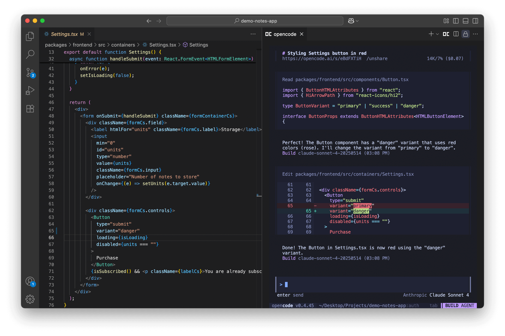
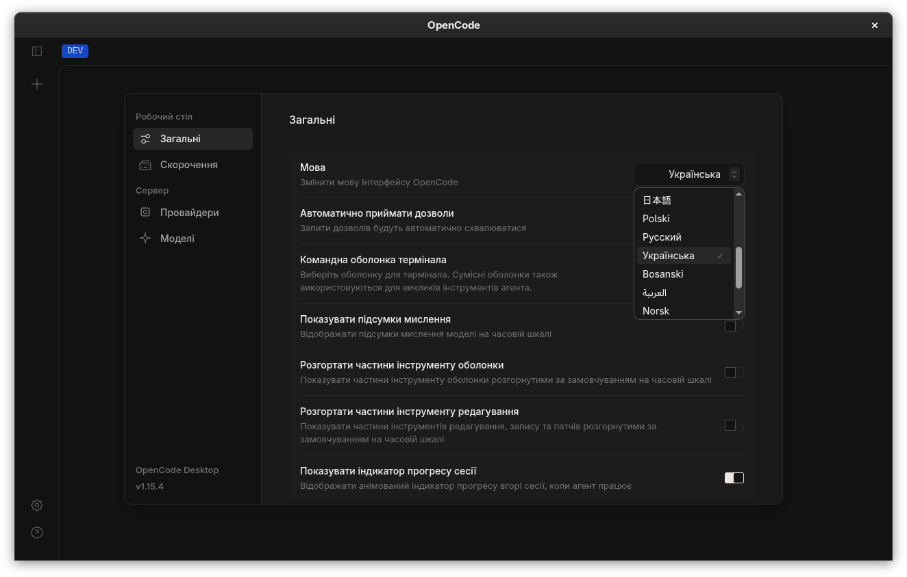
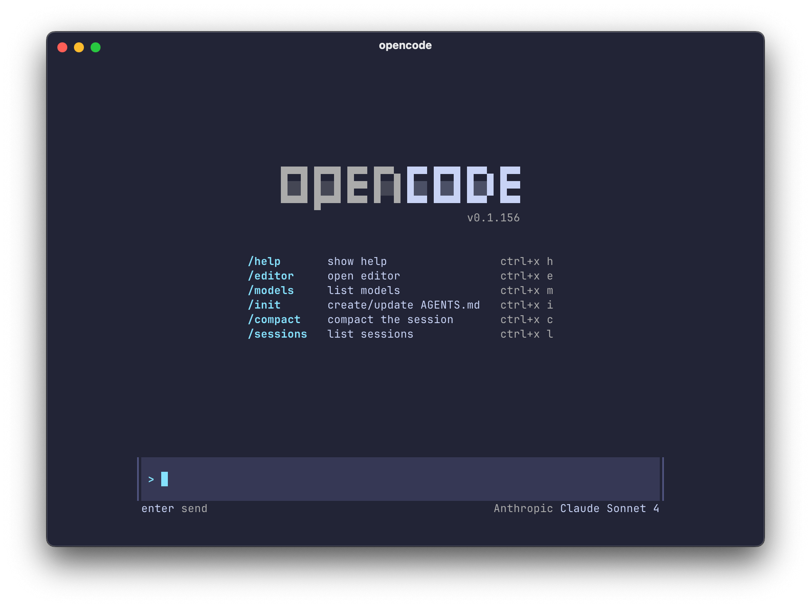

# Gallery

OpenCode+ uses a small, curated screenshot set instead of scattering images through the repository root.

## Current Gallery

| View              | Preview                                                                                                                           | Notes                                                           |
| ----------------- | --------------------------------------------------------------------------------------------------------------------------------- | --------------------------------------------------------------- |
| Terminal workflow |  | Shows the terminal-native agent experience alongside an editor. |
| Web review        |                  | Shows files, output, and session review surfaces.               |
| Desktop settings  |                                        | Fork-owned screenshot stored under `docs/assets`.               |
| Command surface   |                     | Focused entry point for starting and steering sessions.         |

## Refresh Checklist

- Capture the latest OpenCode+ desktop build.
- Capture the latest web UI with fork branding visible.
- Keep all screenshots free of secrets, tokens, and private repository names.
- Use consistent viewport sizes and balanced cropping.
- Store fork-owned captures under `docs/assets/screenshots`.
